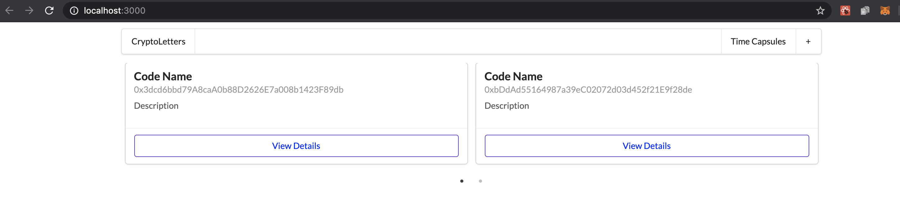
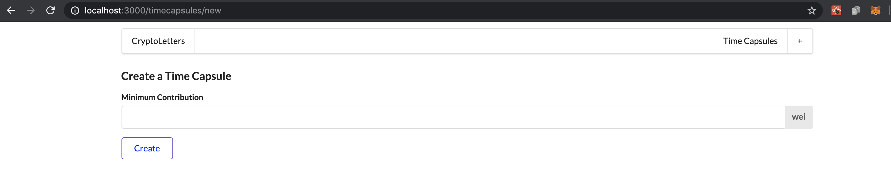

# Ethereum Blockchain Decentralized Application (DApp)

## TimeCapsule Smart Contract (Tokens)

### Instructions

Environment Setup

1. install MetaMask Wallet Chrome Extension - https://metamask.io/ + create a Wallet account.
2. go to https://rinkeby.etherscan.io/ - Factory Contract deployed at Address: 0x09FF5BfA0a0dbFDC06aC07c5c6Cd4C34203b7EED
3. TimeCapsule Tokens created using "fake" Ethers - https://www.rinkeby.io/#faucet.

Run DApp

1. clone repo
2. run "npm install"
4. run "npm run dev"
5. go to "http://localhost:3000/" for the landing page

### Technologies

- React
- NextJS
- Web3
- MetaMask Wallet Chrome Extension
- Solidity
- Rinkeby Ethereum TestNet 
- Infura Node - https://infura.io/
- truffle-hdwallet-provider

### Architecture and Design Considerations

### Challenges

### Screen Shots

1. Contract List (Click on "View Details" button to view details.)

2. Create a new Contract

